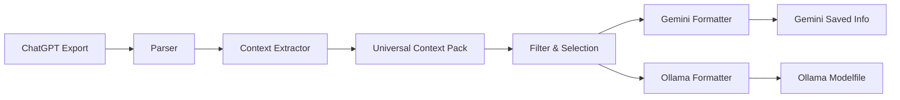

# LLM Context Exporter

A privacy-focused, open-source CLI tool and library that enables users to migrate their accumulated context from ChatGPT to either Google Gemini or local LLMs running via Ollama (specifically Qwen). The tool processes ChatGPT export files entirely locally, extracts meaningful domain knowledge, and packages it in formats optimized for the target platform.

## Key Features

- 🔒 **Privacy-First**: All processing happens locally; no data leaves your machine
- 🔌 **Extensible Architecture**: Plugin-based adapters enable future platform support
- 🎯 **Two Migration Paths**: 
  - ChatGPT → Google Gemini (Saved Info)
  - ChatGPT → Local LLMs via Ollama (Qwen Modelfile)
- 📦 **Context Extraction**: Intelligently extracts projects, preferences, and technical background
- 🎛️ **Selective Filtering**: Control what context is transferred with conversation and topic filters
- 🔄 **Incremental Updates**: Keep your context current without re-exporting everything
- ✅ **Validation Tools**: Generate test questions to verify successful context transfer
- 💻 **CLI & Web Interface**: Use via command line or simple web UI

## Overview

The LLM Context Exporter addresses vendor lock-in concerns by making personal context portable across different AI assistants. It processes official ChatGPT export files, extracts structured domain knowledge, and packages it in formats ready for your target platform.

### How It Works



1. **Parse**: Reads official ChatGPT export files (ZIP or JSON)
2. **Extract**: Identifies projects, preferences, and technical context
3. **Filter**: Allows selective inclusion/exclusion of content
4. **Format**: Packages context for target platform (Gemini or Ollama)
5. **Validate**: Generates test questions to verify transfer

## Installation

### Prerequisites

- Python 3.10 or higher
- (For Ollama output) Ollama installed and configured

### Install from Source

```bash
# Clone the repository
git clone <repository-url>
cd llm-context-exporter

# Install dependencies
pip install -r requirements.txt

# Install the package
pip install -e .
```

### Install from PyPI (when available)

```bash
pip install llm-context-exporter
```

## Quick Start

### Export to Gemini

```bash
llm-context-export \
  --input chatgpt_export.zip \
  --target gemini \
  --output ./gemini_context.txt
```

This generates:
- Formatted text ready to paste into Gemini Saved Info
- Step-by-step instructions for adding to Gemini
- Validation test questions

### Export to Ollama

```bash
llm-context-export \
  --input chatgpt_export.zip \
  --target ollama \
  --model qwen \
  --output ./ollama_modelfile
```

This generates:
- Ollama Modelfile with embedded system prompt
- Setup commands to create your custom model
- Test commands to verify context transfer

### Interactive Filtering

```bash
llm-context-export \
  --input chatgpt_export.zip \
  --target gemini \
  --interactive
```

Browse and select which conversations/topics to include or exclude.

### Incremental Update

```bash
llm-context-export \
  --input new_export.zip \
  --target gemini \
  --update ./previous_context \
  --output ./updated_context
```

Only processes new conversations since the last export.

### Web Interface

```bash
llm-context-export --web --port 8080
```

Open `http://localhost:8080` in your browser for a user-friendly interface.

## Usage Examples

### CLI Usage

#### Basic Export to Gemini

```bash
llm-context-export --input export.zip --target gemini --output context.txt
```

#### Export to Ollama with Custom Base Model

```bash
llm-context-export \
  --input export.zip \
  --target ollama \
  --model llama2 \
  --output ./my_context_modelfile
```

#### Apply Filters via Config File

```bash
llm-context-export \
  --input export.zip \
  --target gemini \
  --filters filters.json \
  --output context.txt
```

#### Generate Validation Tests

```bash
llm-context-export \
  --validate ./context.txt \
  --target gemini
```

### Library Usage

```python
from llm_context_exporter import ChatGPTParser, ContextExtractor, GeminiFormatter

# Parse ChatGPT export
parser = ChatGPTParser()
parsed = parser.parse_export("chatgpt_export.zip")

# Extract context
extractor = ContextExtractor()
context_pack = extractor.extract_context(parsed.conversations)

# Format for Gemini
formatter = GeminiFormatter()
gemini_output = formatter.format_for_gemini(context_pack)

# Use the output
print(gemini_output.formatted_text)
print(gemini_output.instructions)
```

## Architecture

The tool follows a pipeline architecture with clear separation of concerns:

### Core Components

1. **Platform Parsers**: Convert platform-specific exports to a universal format
   - `ChatGPTParser`: Parses official ChatGPT export files

2. **Context Extractor**: Analyzes conversations and extracts structured knowledge
   - Project identification
   - User profile extraction
   - Preference detection
   - Technical context extraction

3. **Universal Context Pack**: Platform-agnostic representation of user context
   - UserProfile (role, expertise, background)
   - ProjectBrief[] (projects with tech stack and status)
   - UserPreferences (coding style, tools, patterns)
   - TechnicalContext (languages, frameworks, domains)

4. **Filter Engine**: Selective content filtering
   - Conversation exclusion
   - Topic-based filtering
   - Date range filtering
   - Preference persistence

5. **Platform Formatters**: Convert universal context to platform-specific formats
   - `GeminiFormatter`: Creates Gemini Saved Info text
   - `OllamaFormatter`: Generates Ollama Modelfile

6. **Validation Generator**: Creates test questions to verify context transfer

### Extensibility

The architecture supports adding new platforms through adapter interfaces:

- **Adding Source Platforms**: Implement `PlatformParser` interface
- **Adding Target Platforms**: Implement `PlatformFormatter` interface

See the [Design Document](.kiro/specs/llm-context-exporter/design.md) for detailed adapter interface documentation.

## Privacy & Security

### Local-Only Processing

✅ All processing happens entirely on your machine  
✅ No network requests made during export processing  
✅ No data transmitted to external services (except payment processing via Stripe for web interface)

### Data Protection

- **Encryption**: Context packages can be encrypted at rest using AES-256-GCM
- **Sensitive Data Detection**: Prompts for redaction of detected sensitive information (emails, API keys, etc.)
- **Secure Deletion**: Overwrites files before deletion

### Web Interface Security

- Runs on localhost only (127.0.0.1) by default
- Session-based file storage with auto-cleanup
- CSRF protection
- Rate limiting

## Data Models

### Universal Context Pack

The core data structure representing portable user context:

```python
UniversalContextPack:
  - version: str
  - created_at: datetime
  - user_profile: UserProfile
  - projects: List[ProjectBrief]
  - preferences: UserPreferences
  - technical_context: TechnicalContext
  - metadata: Dict[str, Any]
```

See the [Design Document](.kiro/specs/llm-context-exporter/design.md#data-models) for complete schema definitions.

## Platform Comparison

### Gemini (Cloud)

**Pros:**
- Easy to use (paste text into Saved Info)
- Accessible from anywhere
- Powerful model capabilities

**Cons:**
- Context stored in the cloud
- Limited size (~32KB practical limit)
- Requires Google account

### Ollama (Local)

**Pros:**
- Complete privacy (runs on your machine)
- No size limits for system prompts
- No internet required after setup
- Full control over the model

**Cons:**
- Requires installation and setup
- Requires adequate hardware (RAM, storage)
- May have different capabilities than cloud models

## Limitations & Disclaimers

- **Platform Differences**: Target LLMs may interpret context differently than ChatGPT
- **Format Changes**: ChatGPT export format changes may require tool updates
- **Feature Gaps**: Some ChatGPT-specific features may not transfer
- **Context Interpretation**: Success depends on how well the target LLM understands the formatted context

The tool logs what was skipped and why, helping you understand what might not transfer.

## Testing & Validation

### Property-Based Testing

The project uses property-based testing (Hypothesis) to ensure correctness across a wide range of inputs. Key properties tested include:

- Parse preservation
- Schema conformance
- Filter correctness
- Local-only processing guarantees

### Validation Questions

After export, the tool generates test questions to verify successful context transfer:

```bash
llm-context-export --validate ./context.txt --target gemini
```

## Contributing

Contributions are welcome! The project follows these principles:

- **Open Source Core**: All core functionality is open-source
- **Extensible Architecture**: Clear interfaces for adding new platforms
- **Privacy-First**: All code must be auditable for local-only processing
- **Comprehensive Testing**: Property-based tests for correctness guarantees

### Adding New Platforms

1. **Source Platform**: Implement `PlatformParser` interface
2. **Target Platform**: Implement `PlatformFormatter` interface

See the [Design Document](.kiro/specs/llm-context-exporter/design.md#extensibility-points) for detailed instructions.

## Documentation

- **[Requirements](.kiro/specs/llm-context-exporter/requirements.md)**: Detailed functional requirements
- **[Design Document](.kiro/specs/llm-context-exporter/design.md)**: Architecture and implementation details
- **[Implementation Plan](.kiro/specs/llm-context-exporter/tasks.md)**: Development roadmap

## License

[License to be specified - open source license permitting commercial use]

## Support

- **Issues**: Report bugs or request features on GitHub
- **CLI Help**: `llm-context-export --help`
- **Documentation**: See `.kiro/specs/llm-context-exporter/` for detailed specs

## Roadmap

### v1.0 (Current)

- ✅ ChatGPT export parsing
- ✅ Context extraction
- ✅ Gemini formatter
- ✅ Ollama formatter
- ✅ CLI interface
- ✅ Web interface
- ✅ Filtering & selection
- ✅ Incremental updates
- ✅ Validation tools

### Future Considerations

- Support for more source platforms (Claude, Perplexity, etc.)
- Support for more target platforms
- Context compression and summarization
- Automatic sync/update scheduling
- Multi-user/team context sharing

